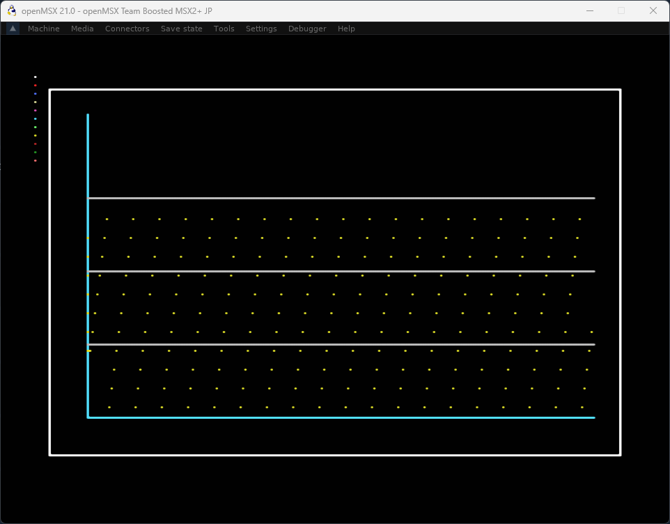
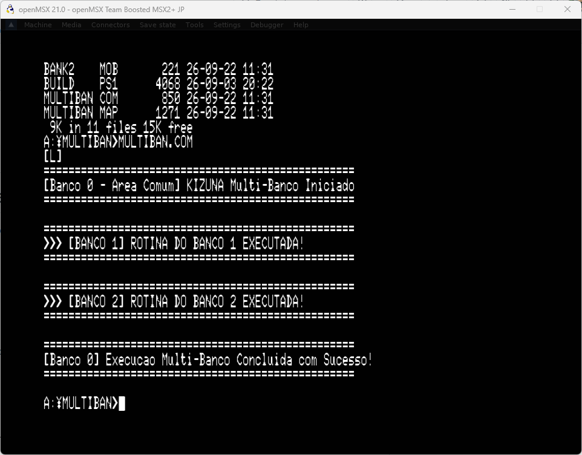

# KIZUNA (絆)

> "Um laço entre linguagens, amarrado num único `.COM`."

**KIZUNA** é uma proposta de toolchain para MSX2+ (Z80 / MSX-DOS 2 / 256Kb
ou mais com memory mapper) que permite escrever partes de um mesmo programa em
**Assembly Z80**, **Pascal** (estilo Turbo Pascal 4, com units) e
**MSX-BASIC Dignified**, compilar cada parte separadamente e linkar tudo
num único executável — inclusive distribuindo módulos por bancos de
memória diferentes, com troca de banco resolvida automaticamente pelo
linker.

Versão Atual: `v4.11.0` — Release **Kakuchou (拡張)**.

## Por quê

MSX-DOS 2 herda compatibilidade de BDOS do CP/M-80, plataforma onde
linguagens como Macro-80, Fortran-80 e Cobol-80 já linkavam juntas via um
formato de objeto comum. O Turbo Pascal 3 (até a 3.3) rodava nesse mesmo
mundo, mas **não permitia linkar com outras linguagens**; foi o Turbo
Pascal 4, com suas units e a diretiva `{$L}` para `.OBJ` externos, que
passou a **permitir** essa integração — só que ficou restrito a
MS-DOS/x86. O KIZUNA recupera essa ideia — um Pascal fiel ao TP4, gerando
código nativo para MSX2+, aproveitando os 256Kb (ou mais) via bank
switching com Memory Mapper, e permitindo combinar Assembly, Pascal e
BASIC estruturado no mesmo binário `.COM`.

## As ferramentas

| Nome      | Papel                                 | Status                            |
| --------- | ------------------------------------- | --------------------------------- |
| `KAJI80`  | Assembler Z80 modular                 | **Concluído & Validado — recursos de macro-assembler ao estilo asMSX (expressões, rótulos locais, `IF`/`REPT`/`MACRO`, rótulos pré-definidos de BIOS/BDOS, `CALLBIOS`/`CALLDOS`, `INCBIN`)** (v4.11.0) |
| `WIRTH80` | Compilador Pascal (TP4-like)          | **Concluído & Validado — `procedure`/`function`, `PUBLIC`/`EXTERN`, `BANK <n>`** (v4.10.0) |
| `DIGNAC`  | Compilador MSX-BASIC Dignified        | **Concluído & Validado — tipos reais + aritmética SINGLE (`+`/`-`/comparação), confirmado em hardware** (v4.10.0) |
| `MUSUBI`  | Linker com Smart-Linking e Mapper     | **Concluído & Validado — um único ponto de entrada garantido por executável** (v4.9.0) |
| `HAKO`    | Bibliotecário / Empacotador (`.hlib`) | **Concluído & Validado** (v4.3)   |
| `MOBDUMP` | Inspecionador de objetos `.MOB`       | **Concluído & Validado** (v4.2)   |
| `MSXLIB`  | Biblioteca padrão (BDOS/BIOS/VDP/PSG) | **Concluído & Validado — SCREEN 2, sprites, música PSG e I/O de arquivo confirmados em hardware** (v4.7.0) |
| `OBI`     | Orquestrador de build (`Obifile`)     | **Concluído & Validado, confirmado em hardware — as 3 linguagens linkadas num único `.COM`, testado em hardware real** (v4.9.0) |

Cada compilador/assembler gera um objeto relocável no formato próprio `.MOB`;
`MUSUBI` linka os módulos (com eliminação de código morto via Smart-Linking e
trampolins automáticos de bank switching) e produz o `.COM` final para MSX-DOS 2.

## Exemplos e Testes

- `sample/hello.asm`: Exemplo clássico em Assembly Z80.
- `sample/multibank/`: Exemplo multi-banco chaveando bancos na Página 2 (0x8000..0xBFFF).
- `sample/libdemo/`: Exemplo consumindo rotinas da biblioteca `msxlib.hlib` com Smart-Linking.
- `sample/pascal/`:
  - `hello.pas`: Primeiro Hello World em Pascal nativo para MSX (binário de apenas 326 bytes).
  - `calc.pas`: Programa demonstrando variáveis inteiras, cálculo aritmético de 16 bits e chamadas à biblioteca.
- `sample/basic/`:
  - `hello.bas`: Hello World em MSX-BASIC Dignified compilado para `.COM` (apenas 186 bytes).
  - `calc.bas`: Aritmética de 16 bits, variáveis locais e formatação de texto com smart-linking.
  - `chart.bas`: Módulo gráfico paginado no banco 2 para desenhar gráficos com `LINE`, `BF` e `PSET`.
- `sample/obi/`: Receita `Obifile` real (não ilustrativa) orquestrando `KAJI80`
  (banco 0, dono do `Start`) + `DIGNAC` (banco 2, módulo biblioteca sem
  `PROCEDURE Main`) + um resource binário embutido + `msxlib.hlib`, tudo com
  um único comando `obi build`.
- `sample/sprites/`: Define um padrão 16x16 e move um sprite pela tela em
  SCREEN 2 (`VDP_SpriteDefine`/`VDP_SpriteSet`).
- `sample/music/`: Toca uma escala simples via `PSG_PlaySequence` e a nova
  tabela de períodos de nota (`PSG_NoteTable`, 5 oitavas).
- `sample/fileio/`: Cria, escreve, fecha, reabre, lê e imprime de volta um
  arquivo (`BDOS_FileCreate/Open/Read/Write/Close`, MSX-DOS 2 baseado em
  handle).

### Estado atual da SCREEN 2 (causa raiz encontrada e confirmada em hardware)

**A causa raiz real do traçado gráfico bagunçado em SCREEN 2 foi encontrada e
corrigida na v4.5.2, após várias sessões investigando na direção errada
(timing de VRAM, atomicidade de interrupção, motor de comando de hardware do
V9938 — nenhuma delas era o problema), e confirmada visualmente em
hardware/emulador real na v4.5.3.** Eram **dois bugs independentes**:

1. **`KAJI80` codificava operações ALU com operando indexado
   (`CP (IX+d)`, `SUB (IX+d)`, etc.) como se fossem um imediato de 8 bits —
   em silêncio, sem erro de montagem.** `CP (IX+8)` virava `CP 0` (opcode
   `FE 00`) em vez do `DD BE 08` correto. As únicas 9 ocorrências dessa forma
   no projeto inteiro estavam todas dentro de `VDP_Line`/`VDP_BoxFill`
   (`lib/src/vdp.asm`) — o que explica por que o bug só aparecia ali. Com a
   comparação de fim de linha e o cálculo de Bresenham recebendo sempre `0`
   em vez do X/Y real, `VDP_Line` desenhava uma escada de parâmetros errados
   em vez de uma linha reta, e o teste de horizontal/vertical pura nunca
   disparava — o que também explica o dump de VRAM de uma sessão anterior
   que parecia (erradamente) apontar para corrupção do registrador `DE`
   entre chamadas.
2. **`VDP_PSet_Raw` sobrescrevia o byte inteiro do padrão em vez de fazer
   leitura-modificação-escrita**, apagando os outros 7 pixels da mesma linha
   da célula 8x8 a cada ponto plotado — por isso sobrava só 1 pixel a cada 8
   em qualquer `LINE`/`BOXFILL`. Esse bug ficava mascarado pelo primeiro
   (só teria efeito visível depois de corrigi-lo).

Confirmado por remontagem e leitura direta dos bytes do `.MOB` (não apenas
análise estática); ambos corrigidos juntos. **Confirmado visualmente em
hardware/emulador real na v4.5.3** — ver a captura de tela e a listagem
completa de `sample/basic/chart.bas` na seção seguinte.

De brinde, a mesma auditoria encontrou (e corrigiu) mais um ponto de
robustez no linker `MUSUBI`, sem relação com o bug gráfico: um segmento
`BSS` num banco comum não contribuía bytes reais ao `.COM` (por design do
formato `.MOB`), mas o endereço reservava o espaço mesmo assim — em build
multi-banco, isso deslocava para trás qualquer coisa posicionada depois
dele (dispatcher/trampolins). Corrigido materializando BSS como zeros
reais no binário final.

Bugs históricos já corrigidos em sessões anteriores, mantidos aqui por
completude:
- **Dois bugs de dessincronia Pass 1/Pass 2 no assembler `KAJI80`**
  (`LD A,(rótulo)` mal dimensionado, e `rótulo: DB valor` contando o próprio
  mnemônico como dado) — cada um corrompia silenciosamente o endereço de todo
  rótulo declarado depois no mesmo módulo. O `Assemble()` verifica essa
  consistência internamente e falha a montagem com erro claro em vez de gerar
  um binário corrompido silenciosamente.
- **Um bug real no linker `MUSUBI`**: um salto relativo (`JR Z`) calculado
  errado por 1 byte no carregador multi-banco.
- **`BIOS_CHGET` só respondia à tecla ESC**, ignorando qualquer outra tecla.
- **`VDP_PSet` nunca escrevia a cor** (só o bit do pixel).

Ver `CHANGELOG.md` para o detalhamento completo.

Enquanto isso, **Assembly (KAJI80), Pascal (WIRTH80) e o restante de MSX-BASIC
Dignified (DIGNAC) continuam avançando normalmente** — o problema estava
isolado às rotinas gráficas de VDP da MSXLIB, não à toolchain em si.

O MSXgl e o Fusion-C em `resource/` são usados somente como referências de
hardware e algoritmos. A implementação final continuará na ABI própria da
MSXLIB, compartilhada por Assembly, Pascal e BASIC.

## Mostra: evolução do kit — de `.bas` a SCREEN 2 real

Como evidência concreta do estado atual, o exemplo `sample/basic/chart.bas`
abaixo — escrito em MSX-BASIC Dignified, compilado pelo `DIGNAC`, linkado com
a `MSXLIB` pelo `MUSUBI` e rodando sem qualquer edição manual do `.COM`
resultante — mostra o pipeline completo funcionando de ponta a ponta:

```basic
' ============================================================
' KIZUNA sample -- Modulo Chart em MSX-BASIC Dignified
' Compilador: DIGNAC
' ============================================================

MODULE Chart
BANK 0
PUBLIC Main, Desenhar
EXTERN BIOS_CHGET

' Ponto de entrada para demonstracao grafica standalone
PROCEDURE Main()
    SCREEN 2
    Desenhar(10)
    BIOS_CHGET()
    SCREEN 0
END PROCEDURE

' Desenhar: recebe um valor e traça um gráfico com moldura,
' eixos cartesianos, grade e curva calculada.
PROCEDURE Desenhar(valor%)
    LOCAL x%, y%

    ' Checkpoints: um PSET de cor unica por etapa, na coluna x=2 (fora da
    ' area da moldura/eixos/grade/curva, ninguem mais escreve ali), cada um
    ' numa linha Y diferente para nao dar color clash entre eles.
    ' Ordem/cores: 15 branco, 8 vermelho medio, 5 azul claro, 11 amarelo
    ' claro, 13 magenta, 7 ciano, 3 verde claro, 10 amarelo escuro,
    ' 6 vermelho escuro, 12 verde escuro, 9 rosa/vermelho claro.

    ' 1. Limpa a tela com fundo preto
    LINE (0,0)-(255,191), 1, BF
    PSET (2, 2), 15   ' checkpoint 1: BoxFill (limpar tela) OK
    BIOS_CHGET()

    ' 2. Moldura retangular externa branca (cor 15)
    LINE (8, 8)-(247, 8), 15
    PSET (2, 6), 8    ' checkpoint 2: borda topo OK
    BIOS_CHGET()
    LINE (247, 8)-(247, 183), 15
    PSET (2, 10), 5   ' checkpoint 3: borda direita OK
    BIOS_CHGET()
    LINE (247, 183)-(8, 183), 15
    PSET (2, 14), 11  ' checkpoint 4: borda baixo OK
    BIOS_CHGET()
    LINE (8, 183)-(8, 8), 15
    PSET (2, 18), 13  ' checkpoint 5: borda esquerda OK
    BIOS_CHGET()

    ' 3. Eixos cartesianos em Ciano (cor 7)
    LINE (24, 20)-(24, 165), 7
    PSET (2, 22), 7   ' checkpoint 6: eixo vertical OK
    BIOS_CHGET()
    LINE (24, 165)-(236, 165), 7
    PSET (2, 26), 3   ' checkpoint 7: eixo horizontal OK
    BIOS_CHGET()

    ' 4. Linhas de grade horizontais em Cinza (cor 14)
    LINE (24, 130)-(236, 130), 14
    PSET (2, 30), 10  ' checkpoint 8: grade 1 OK
    BIOS_CHGET()
    LINE (24, 95)-(236, 95), 14
    PSET (2, 34), 6   ' checkpoint 9: grade 2 OK
    BIOS_CHGET()
    LINE (24, 60)-(236, 60), 14
    PSET (2, 38), 12  ' checkpoint 10: grade 3 OK
    BIOS_CHGET()

    ' 5. Curva de pontos do grafico em Amarelo (cor 10)
    FOR x% = 25 TO 235
        y% = 160 - (x% MOD (valor% + 1)) * 9
        PSET (x%, y%), 10
    NEXT x%
    PSET (2, 42), 9   ' checkpoint 11: curva (loop completo) OK
    BIOS_CHGET()

END PROCEDURE
END MODULE
```

Resultado da execução em openMSX (MSX2+ Boosted, SCREEN 2, 256x192) —
moldura branca, eixos em ciano, grade cinza e curva de pontos amarela, todos
renderizados corretamente:



## Mostra: bank switching automático real (`sample/multibank/`)

**O bootstrap multi-banco do MUSUBI teve uma regressão real, encontrada e
corrigida na v4.6.0.** O multi-banco funcionava desde a v4.1.0 "Akatsuki"
(quando esse suporte foi introduzido) com um mapeamento simples: número de
segmento físico da Memory Mapper = número de banco do linker. A sessão da
v4.5.2 "Yoake" trocou isso por alocação dinâmica de segmento via `ALL_SEG`
do EXTBIO — em teoria mais correta (evita colidir com um segmento que o
MSX-DOS 2 ou outro processo já esteja usando), mas **nunca tinha sido
executada de verdade**, só validada por análise estática e um script de
conferência de bytes. Rodando `sample/multibank` de novo em hardware real
na v4.6.0, o programa carregava e voltava limpo para o prompt do MSX-DOS
sem executar nada — uma regressão silenciosa. Confirmado contra a
documentação oficial do protocolo EXTBIO
([map.grauw.nl/resources/dos2_environment.php](http://map.grauw.nl/resources/dos2_environment.php))
que faltava inicializar o registrador `B` (seleção de mapper) antes de
`ALL_SEG`; corrigido isso e o problema persistiu, confirmando que a
alocação dinâmica em si era a causa. Revertido para o mapeamento
identidade original — a única versão deste bootstrap já confirmada
funcionando em hardware — mantendo as melhorias de qualidade de código da
v4.5.2 que não tinham relação com o bug (resolução de saltos por endereço
absoluto via `patchJP()`, em vez de deslocamentos `JR` contados à mão).

O exemplo abaixo — um módulo em Assembly puro por banco, sem biblioteca
nem outra linguagem envolvida, para isolar só o mecanismo de bank
switching — mostra o `MUSUBI` gerando o trampolim de troca de banco
automaticamente: `main.asm` (Banco 0, Área Comum) chama `PrintBank1` e
`PrintBank2` como se fossem rotinas locais comuns; o linker detecta que
os símbolos vivem em bancos pagináveis diferentes e insere a troca de
página sozinho, sem o programador escrever nenhum código de paginação.

```asm
; main.asm -- Banco 0 (Área Comum)
MODULE MAIN
BANK 0

PUBLIC Start
EXTERN PrintBank1, PrintBank2

BDOS       EQU 0x0005
C_WRITE    EQU 0x09

Start:
    ; 1. Mensagem a partir do Banco 0 (Área Comum)
    ld   de, MsgCommon
    ld   c, C_WRITE
    call BDOS

    ; 2. Chamada Cross-Bank: Salta para rotina no Banco 1
    ; O MUSUBI intercepta esta chamada e gera o trampolim automático!
    call PrintBank1

    ; 3. Chamada Cross-Bank: Salta para rotina no Banco 2
    ; O MUSUBI intercepta e troca para o Banco 2 na Página 2!
    call PrintBank2

    ; 4. Mensagem final do Banco 0 e retorno limpo ao MSX-DOS
    ld   de, MsgDone
    ld   c, C_WRITE
    call BDOS

    ret

MsgCommon:
    db 0x0D, 0x0A
    db "==================================================", 0x0D, 0x0A
    db "[Banco 0 - Area Comum] KIZUNA Multi-Banco Iniciado", 0x0D, 0x0A
    db "==================================================", 0x0D, 0x0A
    db "$"

MsgDone:
    db 0x0D, 0x0A
    db "==================================================", 0x0D, 0x0A
    db "[Banco 0] Execucao Multi-Banco Concluida com Sucesso!", 0x0D, 0x0A
    db "==================================================", 0x0D, 0x0A
    db "$"

ENDMOD
```

```asm
; bank1.asm -- Banco 1 (paginável na Página 2, 0x8000..0xBFFF)
MODULE BANK1
BANK 1

PUBLIC PrintBank1

BDOS       EQU 0x0005
C_WRITE    EQU 0x09

PrintBank1:
    ; Imprime mensagem oficial do Banco 1 na Página 2
    ld   de, MsgBank1
    ld   c, C_WRITE
    call BDOS
    ret

MsgBank1:
    db 0x0D, 0x0A
    db "==================================================", 0x0D, 0x0A
    db ">>> [BANCO 1] ROTINA DO BANCO 1 EXECUTADA!", 0x0D, 0x0A
    db "==================================================", 0x0D, 0x0A
    db "$"

ENDMOD
```

```asm
; bank2.asm -- Banco 2 (paginável na Página 2, 0x8000..0xBFFF)
MODULE BANK2
BANK 2

PUBLIC PrintBank2

BDOS       EQU 0x0005
C_WRITE    EQU 0x09

PrintBank2:
    ; Imprime mensagem oficial do Banco 2 na Página 2
    ld   de, MsgBank2
    ld   c, C_WRITE
    call BDOS
    ret

MsgBank2:
    db 0x0D, 0x0A
    db "==================================================", 0x0D, 0x0A
    db ">>> [BANCO 2] ROTINA DO BANCO 2 EXECUTADA!", 0x0D, 0x0A
    db "==================================================", 0x0D, 0x0A
    db "$"

ENDMOD
```

Resultado da execução em openMSX (MSX2+ Boosted, MSX-DOS 2) — `[L]` do
bootstrap, seguido das três mensagens (Banco 0 → Banco 1 → Banco 2 → Banco
0), e retorno limpo ao prompt:



## Instalação Rápida

Baixe o pacote `kizuna-vX.Y.Z-dist.zip` na página de Releases do GitHub e execute:

```cmd
install.cmd
```

O instalador interativo em modo texto (TUI) copiará os binários, a biblioteca padrão e configurará o PATH do sistema automaticamente.

## Licença

Consulte o arquivo [LICENSE](LICENSE) para mais detalhes.
